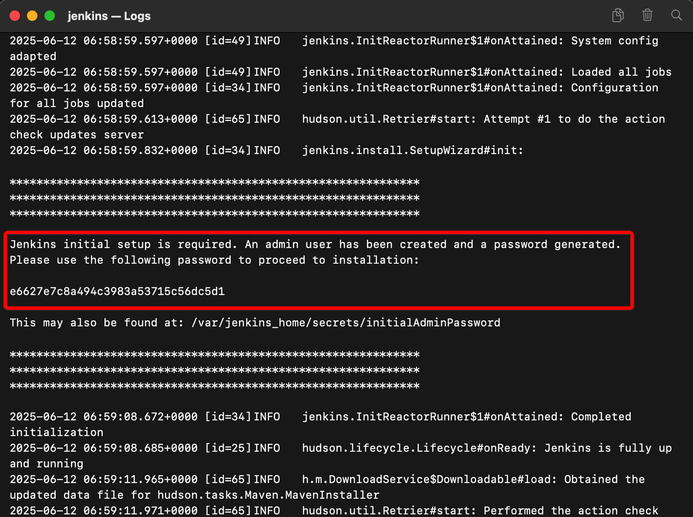
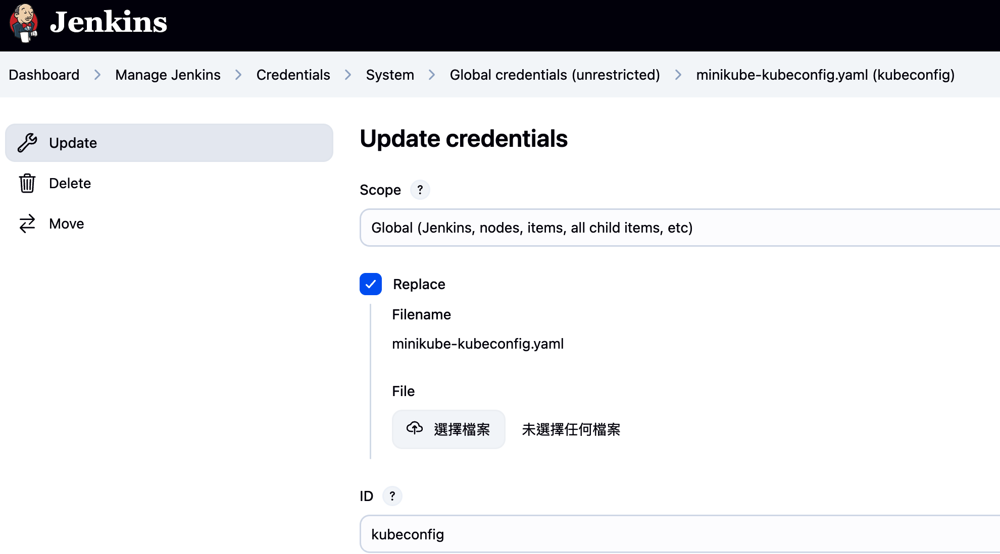
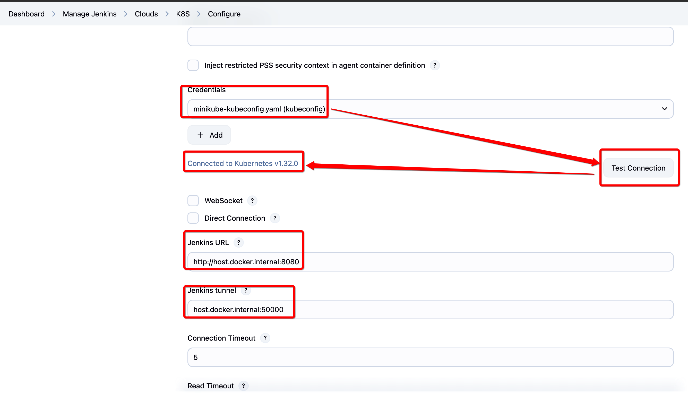
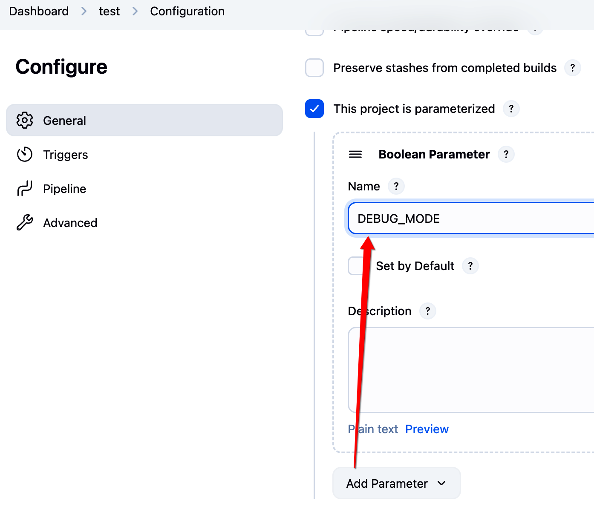
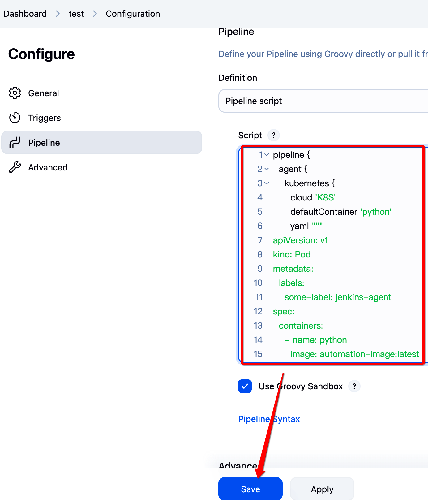
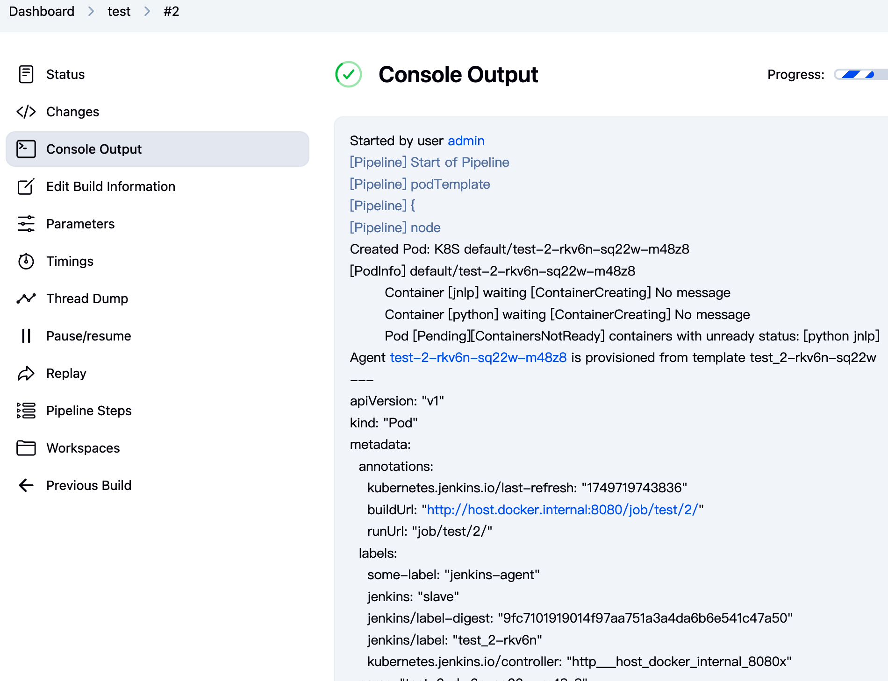
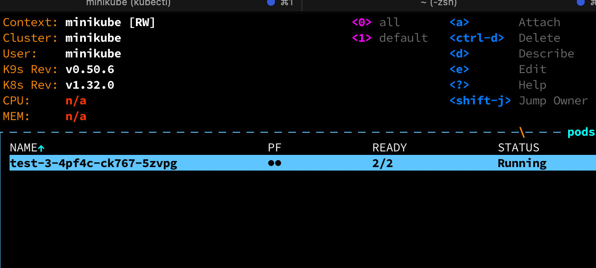
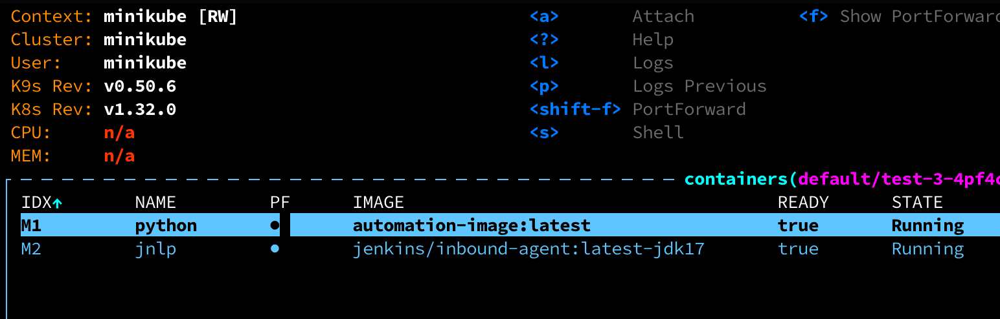

# 🚀 Local Kubernetes Development on macOS

## Create your own K8s playground using `kubectl`, `minikube`, and `k9s`

---

## 🗭 Introduction

| Tool         | Role                            | What it does                                          |
| ------------ | ------------------------------- | ----------------------------------------------------- |
| **minikube** | Local Kubernetes Cluster Engine | Starts and manages a K8s cluster locally              |
| **kubectl**  | Kubernetes CLI                  | Controls resources like Pods / Services / Deployments |
| **k9s**      | Terminal UI Tool                | Visualizes and monitors K8s resources in real-time    |

---

## 🛠️ System Requirements

* [Homebrew](https://brew.sh/) must be installed

---

## 🚜 Install `minikube`

```bash
brew install minikube
```

Start the cluster:

```bash
minikube start --driver=docker
```

Check cluster status:

```bash
minikube status
```

---

## 👛 Install `kubectl`

```bash
brew install kubectl
```

Verify:

```bash
kubectl version --client
```

---

## 🐣 Install `k9s`

```bash
brew install k9s
```

Launch the terminal UI:

```bash
k9s
```

---

## ✅ Verify Everything Works

Create a test deployment:

```bash
kubectl create deployment hello-minikube --image=kicbase/echo-server:1.0
kubectl expose deployment hello-minikube --type=NodePort --port=8080
minikube service hello-minikube
```

---

## 🔄 Tools Relationship Overview

| Tool     | Role                  | Related To                     |
| -------- | --------------------- | ------------------------------ |
| minikube | Runs local Kubernetes | Operated by kubectl & k9s      |
| kubectl  | CLI for managing K8s  | Sends commands to the cluster  |
| k9s      | Terminal-based K8s UI | Uses kubeconfig for connection |

---

## 📁 Build Docker Image

```bash
eval $(minikube docker-env)
docker build -t automation-image:latest .
```

---

## 🚀 Launch Jenkins

```bash
docker compose up -d
```

First-time login requires checking container logs for password:



---

## Install Required Jenkins Plugins

* Go to `Manage Jenkins > Plugin > Available`
* Install:

  * `Pipeline`
  * `Kubernetes`
* Restart Jenkins

---

## Generate K8s Credential

```bash
./auto_generate_k8s_credential_for_jenkins.sh
```

This generates:

* `minikube-kubeconfig.yaml`

---

## Upload Kubeconfig to Jenkins

`Manage Jenkins > Credentials > Global > Add kubeconfig`

Upload `minikube-kubeconfig.yaml`



---

## Configure Kubernetes Cloud in Jenkins

`Manage Jenkins > Cloud > K8S > Configure`

* Jenkins URL: `http://host.docker.internal:8080`
* Tunnel: `host.docker.internal:50000`



---

## Create Pipeline Job

* New Item > Choose `pipeline`
* Add a bool param `DEBUG_MODE`
* Paste your pipeline script




---

## Run the Job

* Run the job from Jenkins UI
* It should spin up a K8s pod to run Python script



If `DEBUG_MODE` is ON, it will run `tail -f /dev/null` to keep the container alive.

Use `k9s` to see running pods:



And containers inside:



To stop, manually cancel the job in Jenkins.