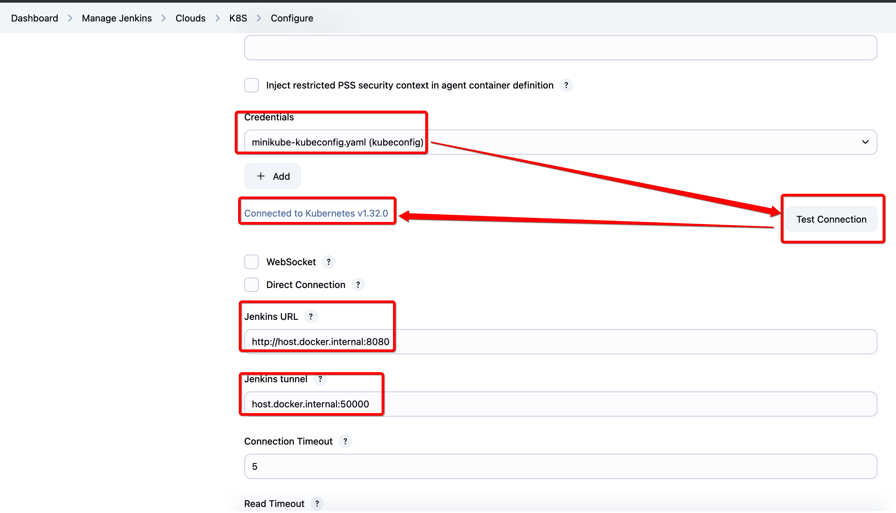
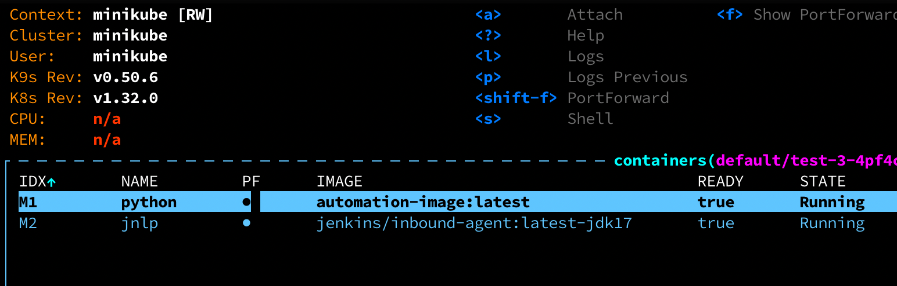

# 🚀 macOS Kubernetes 本地開發環境建立教學

---

## 🗭 前言

| 工具           | 角色                        | 你會用來做什麼                                   |
| ------------ | ------------------------- | ----------------------------------------- |
| **minikube** | 本機 Kubernetes cluster 啟動器 | 啟動、建立本機 K8s cluster                       |
| **kubectl**  | Kubernetes CLI            | 操作 Pods / Services / Deployments 等 K8s 資源 |
| **k9s**      | 終端視覺化 UI 操作器              | 可視化瀏覽 K8s 資源與狀態                           |

---

## 🛠️ 系統需求

* 安裝好 [Homebrew](https://brew.sh/)

---

## 🚜 安裝 `minikube`

```bash
brew install minikube
```

啟動 cluster:

```bash
minikube start --driver=docker
```

確認 cluster 狀態:

```bash
minikube status
```

---

## 👛 安裝 `kubectl`

```bash
brew install kubectl
```

檢查版本:

```bash
kubectl version --client
```

---

## 🐣 安裝 `k9s`

```bash
brew install k9s
```

啟動終端 UI:

```bash
k9s
```

---

## ✅ 驗證環境

建立 test deployment:

```bash
kubectl create deployment hello-minikube --image=kicbase/echo-server:1.0
kubectl expose deployment hello-minikube --type=NodePort --port=8080
minikube service hello-minikube
```

---

## 🔄 工具關係圖

| 工具       | 功能                   | 與其他關聯               |
| -------- | -------------------- | ------------------- |
| minikube | 啟動 local K8s cluster | kubectl / k9s 供操作   |
| kubectl  | CLI 控制端              | 對 cluster 下 command |
| k9s      | UI-like 終端操作         | 使用 kubeconfig 連線    |

---

## 📁 打包 Docker image

```bash
eval $(minikube docker-env)
docker build -t automation-image:latest .
```

---

## 🚀 啟動 Jenkins

```bash
docker compose up -d
```

第一次啟動手動取得 admin password:


---

## 安裝 Jenkins Plugin

* 前往 `Manage Jenkins > Plugin > Available`
* 安裝:

  * `Pipeline`
  * `Kubernetes`
* 重新啟動 Jenkins

---

## 生成 k8s Credential

```bash
./auto_generate_k8s_credential_for_jenkins.sh
```

會產生:

* `minikube-kubeconfig.yaml`

---

## 上傳 Credential 至 Jenkins

`Manage Jenkins > Credentials > Global > Add kubeconfig`

上傳 `minikube-kubeconfig.yaml`


---

## 設定 Kubernetes Cloud 連線

`Manage Jenkins > Cloud > K8S > Configure`

* Jenkins URL: `http://host.docker.internal:8080`
* Tunnel: `host.docker.internal:50000`



---

## 新增 Pipeline Job

* New Item > 選 pipeline > 填寫 script
* 添加 `DEBUG_MODE` bool 參數


---

## 執行 job

* 啟動 job
* 會啟用 K8s pod 執行 Python script


如果 DEBUG\_MODE 為 ON 會轉入 `tail -f /dev/null` 保持存機

可用 `k9s` 看到 Pod:


與 container 資訊:



記得要手動 Cancel job 來結束執行